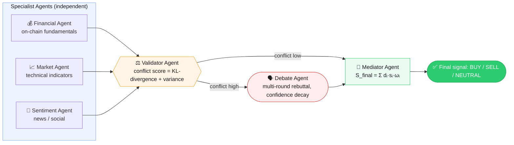

# Multi-Agent Crypto


A multi-agent LLM pipeline for BTC market analysis, using live data. Three specialist agents (financial/on-chain, market/technical, sentiment) each fetch real data and produce an independent belief vector; a validator agent quantifies disagreement between them (KL-divergence + variance); when conflict is high, a debate agent runs multi-round reconciliation; a mediator agent aggregates everything into a final weighted decision (BUY / SELL / NEUTRAL).

> **Status: personal reference tool**, run manually (`python main.py`), BTC only. Not a trading bot — it does not place trades. See [Limitations](#limitations) for the known gaps (notably: on-chain data is free-tier only, no MVRV/SOPR/whale-flow).

---

## Architecture



| Component | File | Responsibility |
|---|---|---|
| Financial Agent | `agents/financial_agent.py` | Fetches live on-chain data (`data_sources/onchain_data.py`), asks the LLM for a signal + belief vector |
| Market Agent | `agents/market_agent.py` | Fetches live Binance market data (`data_sources/market_data.py`), asks the LLM for a signal + belief vector |
| Sentiment Agent | `agents/sentiment_agent.py` | Fetches live Fear&Greed + macro calendar data (`data_sources/sentiment_data.py`), asks the LLM for a signal + belief vector |
| Validator Agent | `agents/validator_agent.py` | Computes a hybrid conflict score (mean pairwise KL-divergence + decision variance), classifies conflict type, triggers root-cause analysis + debate above threshold |
| Debate Agent | `agents/debate_agent.py` | Multi-round adversarial debate; confidence decays per round based on rebuttal strength (cosine / Jaccard / Levenshtein distance) |
| Mediator Agent | `agents/mediator_agent.py` | Aggregates final belief vectors into `S_final = Σ dᵢ·sᵢ·ωᵢ` with entropy / redundancy / time-decay penalties (`utils/penalties.py`) |
| LLM client | `utils/llm.py`, `utils/config.py` | Prefers OpenRouter if `OPENROUTER_API_KEY` is set, otherwise falls back to a local LM Studio server |

### Data sources (`data_sources/`)

| Fetcher | Source | What it gets | Cache TTL |
|---|---|---|---|
| `market_data.py` | Binance public API (free, no key) | Price, EMA20/EMA50/RSI14 (computed from klines), funding rate, long/short ratio | 15 min |
| `sentiment_data.py` | Alternative.me (free) + ForexFactory calendar feed (public, no official API) | Fear & Greed index, upcoming High/Medium-impact macro events | 1 hour |
| `onchain_data.py` | blockchain.info Charts API (free, no key) | Hash rate, miner revenue, tx count, tx volume — **not** MVRV/SOPR/whale-flow (those are paywalled by Glassnode/CryptoQuant) | 3 hours |

Each fetcher caches its result to `outputs/cache/*.json` and falls back to the most recent cache if the live API call fails — it only raises if there is no cache at all.

---

## Setup

Requires **Python 3.11+**.

```bash
python3 -m venv .venv
source .venv/bin/activate        # Windows: .venv\Scripts\activate
pip install -r requirements.txt
# or: pip install -e .
```

Copy the env template and fill in your credentials:

```bash
cp .env.example .env
```

| Backend | When it's used | What to set |
|---|---|---|
| **OpenRouter** (specialist agents) | Always, if any `OPENROUTER_API_KEY*` is set | `OPENROUTER_API_KEY` — global fallback; or `OPENROUTER_API_KEY_FINANCIAL` / `OPENROUTER_API_KEY_MARKET` / `OPENROUTER_API_KEY_SENTIMENT` — per-agent keys for 3x rate limit |
| **Groq** (validator/debate/mediator) | If `GROQ_API_KEY` is set | `GROQ_API_KEY` — get one at [console.groq.com](https://console.groq.com) |
| **LM Studio** (local fallback) | Both OpenRouter and Groq keys are empty | Run [LM Studio](https://lmstudio.ai) locally, serving on `http://127.0.0.1:1234/v1` |
| **Gemini** (embeddings, `rag/` only) | Ingesting/querying the retriever | `GEMINI_API_KEY` — get one at [ai.google.dev](https://ai.google.dev). Not needed to run `main.py`. |

---

## Running

```bash
python main.py
```

This runs the full pipeline — specialist agents fetch live data → validator → (conditional) debate → mediator — and prints the reasoning steps and final decision to the console. If none of the specialist agents can reach the LLM, `main.py` automatically falls back to the cached output in `outputs/logs.json`.

You can also use the Makefile:

```bash
make run            # same as python main.py
make refresh-logs   # re-run only the 3 specialist agents to refresh outputs/logs.json
make test           # run pytest suite
make test-cov       # run pytest with coverage report
```

Ad-hoc smoke-test scripts (not a real test suite yet — see [Limitations](#limitations)):

```bash
python test.py            # basic LLM connectivity check
python test_debate.py     # exercises the debate agent
python test_validator.py  # exercises the validator agent
```

---

## Testing

An automated pytest suite lives in `tests/` and covers the math-heavy core (validator conflict scoring, mediator aggregation, penalties, confidence decay, debate distance metrics), the three specialist agents, and the `rag/` retrieval pipeline. All LLM and embedding calls are mocked, so the suite runs fully offline — no API key needed.

```bash
pip install -e ".[dev]"   # installs pytest + pytest-cov on top of the runtime deps
pytest                    # run the suite
pytest --cov --cov-report=term-missing   # with a coverage report
```

The old `test.py` / `test_debate.py` / `test_validator.py` scripts at the repo root are manual, LLM-hitting smoke tests kept for interactive debugging — they are not part of the automated suite (pytest only looks under `tests/`, see `[tool.pytest.ini_options]` in `pyproject.toml`).

---

## LLM Backend Routing

The system uses **different LLM backends per agent group** to maximize reliability and minimize rate limiting:

| Agent group | Backend | Keys |
|---|---|---|
| Financial, Market, Sentiment | OpenRouter | `OPENROUTER_API_KEY_FINANCIAL` / `_MARKET` / `_SENTIMENT` (fallback: `OPENROUTER_API_KEY`) |
| Validator, Debate, Mediator | Groq | `GROQ_API_KEY` |
| All (fallback) | LM Studio | `BASE_URL` + `API_KEY` |

**Model routing (free tier):**

| Agent | OpenRouter model | Key |
|---|---|---|
| Financial | `inclusionai/ling-3.0-flash-fin:free` | `OPENROUTER_API_KEY_FINANCIAL` |
| Market | `nvidia/nemotron-3.5-lightning:free` | `OPENROUTER_API_KEY_MARKET` |
| Sentiment | `thinking-machines/inkling:free` | `OPENROUTER_API_KEY_SENTIMENT` |
| Validator / Debate / Mediator | `qwen/qwen3.8-27b` on Groq | `GROQ_API_KEY` |

**Why this routing:**
- **3 OpenRouter keys** give 3x the free-tier rate limit for the 3 specialist agents, and isolate 429s so one agent's failure doesn't block the others.
- **3 different OpenRouter models** avoid shared rate-limit pools on the same provider/model.
- **Groq** for validator/debate/mediator because those calls are fast, deterministic, and benefit from Groq's LPU speed.
- **LM Studio** as final fallback if no cloud keys are configured.

You can mix and match: set only `OPENROUTER_API_KEY` for simple use, or set per-agent keys + `GROQ_API_KEY` for maximum parallelism.

## RAG (retrieval pipeline)

`rag/` implements the retrieval-augmented pipeline referenced in `docs/`/`TIPs/`: chunk text or PDFs, embed the chunks with Gemini, and retrieve the top-k most relevant chunks for a query via cosine similarity. It is a standalone module — `main.py` does not call it yet.

```python
from rag.retriever import Retriever
from rag.ingest_pdf import extract_pdf_text

retriever = Retriever()
retriever.ingest(open("data/financial_report.txt").read(), source="financial_report.txt")
# retriever.ingest(extract_pdf_text("some_report.pdf"), source="some_report.pdf")

retriever.save("outputs/rag_index.json")          # persist so you don't re-embed next run
retriever = Retriever.load("outputs/rag_index.json")

top_chunks = retriever.query("whale accumulation trend", top_k=3)
```

Requires `GEMINI_API_KEY` in `.env` (get one at [ai.google.dev](https://ai.google.dev)) — the retriever calls the Gemini embedding API (`EMBEDDING_MODEL`, default `models/text-embedding-004`) on `ingest`/`query`. Chunking (`rag/chunking.py`) and PDF extraction (`rag/ingest_pdf.py`) work standalone without any API key.

---

## Project layout

```text
Multi-Agent-Crypto/
├── agents/         agent implementations (financial, market, sentiment, validator, debate, mediator)
├── data_sources/   live data fetchers used by the 3 specialist agents (Binance, Alternative.me+ForexFactory, blockchain.info)
├── utils/          LLM client, config, prompts, math helpers (penalties, confidence, belief vectors, JSON parsing)
├── data/           legacy static text files — no longer read by the agents, kept for reference only
├── outputs/        run artifacts (logs.json, mediator_result.json, validation_report.json) + cache/ (fetcher cache, gitignored)
├── scripts/        maintenance scripts (refresh_logs.py, future demo/backtest scripts)
├── rag/            retrieval pipeline — chunking, PDF ingestion, Gemini-embedding retriever (standalone, not wired into main.py)
├── tests/          automated pytest suite (mocked LLM/HTTP calls, runs fully offline)
├── docs/           architectural docs (BLUEPRINT, CONTRACT, TASK_GRAPH, LO_TRINH_P3_DATN)
├── pyproject.toml  project metadata, dependencies, pytest config, entry point
├── requirements.txt locked runtime dependencies (generated by pip-tools)
├── Makefile        convenience targets (install, test, run, refresh-logs)
├── main.py         canonical full-pipeline entry point
└── README.md       this file
```

---

## Limitations

- **On-chain data is free-tier only** — `data_sources/onchain_data.py` gives hash rate / miner revenue / tx count / tx volume from blockchain.info. It does **not** include MVRV, SOPR, or real exchange whale-flow — those require a paid provider (Glassnode/CryptoQuant). The Financial Agent's prompt is written to be honest about this gap.
- **`rag/` is not wired into the pipeline** — it's a working standalone retriever (see [RAG](#rag-retrieval-pipeline)), but the specialist agents don't call it; they consume the fetchers' `summary_text` directly.
- **`redundancy_score`** in each agent's metadata is a hand-set constant (not computed) — justified because each agent currently has exactly one canonical data source, so there's no cross-source duplication to measure yet. `entropy` and `recency_weight`, by contrast, are computed from the live fetched data.
- **OpenRouter free-tier models get rate-limited** under shared demand (HTTP 429) — this is an infrastructure limitation of free models, not a bug. If you hit this often, add your own provider key on OpenRouter or point `BASE_URL`/`API_KEY` at a local LM Studio instance instead.
- BTC only — no other coins are supported.
