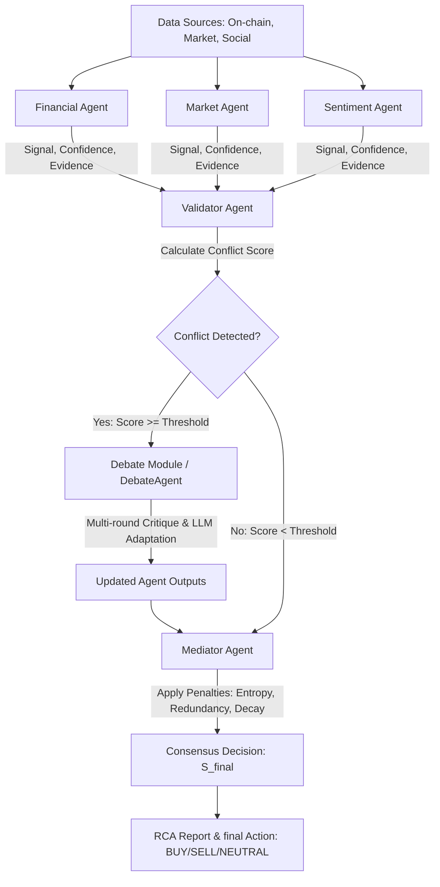

# BÁO CÁO NGHIÊN CỨU & PHÁT TRIỂN PROTOTYPE
## HỆ THỐNG PHÂN TÍCH TÀI CHÍNH & TỰ ĐỘNG GIẢI QUYẾT XUNG ĐỘT ĐA ĐẠI LÝ (MULTI-AGENT CRYPTO SYSTEM)

> **Cập nhật 2026-09-17:** đã rà soát và sửa lại các chi tiết đã lỗi thời (nguồn dữ liệu tĩnh → live fetcher, giá trị tham số β, tình trạng module RAG...) để khớp đúng với codebase hiện tại. Đây là tài liệu kỹ thuật chi tiết nhất (có suy diễn toán học từng bước); bản báo cáo học vụ chính thức, cô đọng theo mẫu HUST nằm ở `docs/BAO_CAO_P3.md`. Lộ trình/roadmap đang hoạt động: `docs/LO_TRINH_P3_DATN.md`.

---

### LỜI MỞ ĐẦU
Báo cáo này trình bày chi tiết về mặt kiến trúc, cơ sở toán học, quy trình vận hành và kết quả thực nghiệm của hệ thống **Multi-Agent Crypto Financial Analysis & Conflict Resolution System**. Đây là một prototype hoàn chỉnh được thiết kế nhằm giải quyết bài toán phân tích thông tin đa chiều từ thị trường tiền mã hóa (Cryptocurrency), đồng thời tự động phát hiện, phân loại và giải quyết xung đột logic giữa các nguồn tri thức khác nhau bằng các mô hình toán học lượng hóa kết hợp với mô hình ngôn ngữ lớn (Large Language Models - LLMs).

---

### 1. ĐẶT VẤN ĐỀ & MỤC TIÊU ĐỀ TÀI

#### 1.1. Thách thức của Thị trường Tiền mã hóa
Thị trường tiền mã hóa có mức độ biến động cực kỳ cao và chịu ảnh hưởng đồng thời bởi ba nhóm yếu tố chính:
1. **Dữ liệu On-chain & Tài chính cơ bản (Financial Fundamentals):** Xu hướng gom tích lũy của cá voi (whales), dòng vốn ra/vào sàn giao dịch, chi phí khai thác của thợ đào. Nhóm dữ liệu này mang tính vĩ mô và dài hạn.
2. **Dữ liệu Kỹ thuật (Technical Market Indicators):** Giá cả thời gian thực, các chỉ báo động lượng (RSI, MACD), bản đồ thanh lý (Liquidation Heatmap), tỷ lệ phí tài trợ (Funding Rate). Nhóm dữ liệu này mang tính ngắn hạn và nhạy cảm với biến động giá.
3. **Tâm lý Xã hội & Tin tức (Social Sentiment & News):** Tin tức kinh tế vĩ mô (chính sách Fed), tin tức ngành (ETF), các tin đồn xã hội (FUD/Hype) và hành vi spam từ các tài khoản bot tự động. Nhóm dữ liệu này có độ nhiễu cực kỳ lớn và dễ bị lặp thông tin (redundancy).

#### 1.2. Hạn chế của các Hệ thống Hiện tại
Các hệ thống phân tích truyền thống thường:
- Phân tích các nguồn dữ liệu một cách độc lập hoặc ghép nối thủ công, dẫn đến việc thiếu sự đồng bộ.
- Khi các nguồn dữ liệu đưa ra các nhận định trái chiều (ví dụ: dữ liệu dài hạn dự báo Tăng nhưng dữ liệu ngắn hạn dự báo Giảm), hệ thống rơi vào trạng thái bế tắc hoặc đưa ra quyết định sai lệch do không có cơ chế dung hòa tri thức.

#### 1.3. Mục tiêu của Prototype
Xây dựng một hệ thống phân tích đa đại lý (Multi-Agent Framework) phân rã nhiệm vụ cho các đại lý chuyên biệt (Specialist Agents), thiết lập một **Đại lý Thẩm định (Validator Agent)** dựa trên các lý thuyết toán học xác suất (KL Divergence, Variance) để nhận diện xung đột cấu trúc, kích hoạt **Vòng tranh biện (Debate Module)** nhằm tối ưu hóa lại độ tin cậy và sử dụng **Đại lý Điều phối (Mediator Agent)** tích hợp các hàm phạt (Penalties) để đưa ra quyết định cuối cùng một cách an toàn và tối ưu nhất.

---

### 2. KIẾN TRÚC TỔNG QUAN CỦA HỆ THỐNG

Hệ thống được thiết kế theo cấu trúc phân tầng, phân nhiệm rõ ràng với luồng xử lý thông tin đi qua 5 giai đoạn chính:

---

### 3. CHI TIẾT CÁC THÀNH PHẦN VÀ CƠ SỞ TOÁN HỌC

#### 3.1. Các Đại lý Chuyên môn (Specialist Agents)
Hệ thống sử dụng ba đại lý chuyên biệt, mỗi đại lý lấy dữ liệu **live** từ một API công khai riêng (không còn đọc file `.txt` tĩnh trong `data/` — các file đó chỉ còn là fixture/sample cũ, không được specialist agent nào tham chiếu trong luồng chạy thật):
- **Financial Agent (Đại lý Tài chính):** Lấy dữ liệu on-chain thời gian thực từ **blockchain.info Charts API** (`data_sources/onchain_data.py`) — hash-rate, miner revenue, số lượng giao dịch, khối lượng giao dịch. Chỉ số `entropy` không do LLM tự chấm mà được tính trực tiếp từ trung bình `|% thay đổi ngày|` của các chỉ số on-chain này.
- **Market Agent (Đại lý Thị trường):** Lấy dữ liệu giá/khối lượng thời gian thực từ **Binance Public API** (`data_sources/market_data.py`, symbol `BTCUSDT`, không cần API key).
- **Sentiment Agent (Đại lý Tâm lý):** Lấy **Fear & Greed Index** từ Alternative.me và lịch sự kiện vĩ mô từ nguồn công khai ForexFactory (`data_sources/sentiment_data.py`).

Cả ba fetcher đều dùng chung một cơ chế **cache-first / stale-fallback**: ưu tiên dùng cache còn hạn (`outputs/cache/`), gọi API mới khi cache hết hạn, và tự động dùng lại dữ liệu cache cũ (kèm cảnh báo) nếu API tạm thời lỗi — tránh sập toàn bộ pipeline chỉ vì một API bên thứ ba không phản hồi.

Tất cả các đại lý chuyên môn đều chuẩn hóa đầu ra theo định dạng `AgentOutput` bao gồm:
1. **Tín hiệu định hướng (Signal):** $BUY$ (Mua), $SELL$ (Bán) hoặc $NEUTRAL$ (Trung lập).
2. **Độ tự tin (Confidence):** $s_i \in [0, 1]$.
3. **Vectơ niềm tin (Belief Vector):** Biểu diễn hướng quyết định $d_i \in \{-1, 0, 1\}$ tương ứng với SELL, NEUTRAL, BUY và cường độ $s_i$.
4. **Logic Path:** Chuỗi các bước lập luận dẫn đến quyết định.
5. **Evidence Chunks:** Các đoạn dữ liệu trích xuất làm bằng chứng kiểm chứng.
6. **Metadata:** Chứa thông tin về độ nhiễu (entropy), độ trùng lặp (redundancy), và nhãn thời gian (timestamp).

---

#### 3.2. Đại lý Thẩm định & Phát hiện Mâu thuẫn (Validator Agent)
Validator Agent đóng vai trò kiểm toán logic và toán học của hệ thống. Nó thực hiện đo lường mức độ bất đồng ý kiến của các đại lý thông qua công thức **Chỉ số Xung đột Lai (Hybrid Conflict Score)**.

##### Bước 1: Ánh xạ Tuyến tính Liên tục (Linear Interpolation Projection)
Để tính toán khoảng cách xác suất giữa các quyết định, Validator Agent ánh xạ vectơ niềm tin rời rạc của mỗi Agent thành một phân phối xác suất liên tục trên không gian quyết định gồm hai trạng thái $\{Bearish, Bullish\}$:
Gọi $x_i = d_i \times s_i$ là giá trị niềm tin liên tục của Agent $i$, trong đó $x_i \in [-1, 1]$. Phân phối xác suất được thiết lập như sau:
$$P_{Bullish} = 0.5 + 0.5 \times x_i$$
$$P_{Bearish} = 0.5 - 0.5 \times x_i$$

*Ưu điểm:* Tránh hiện tượng phân kỳ vô hạn hoặc đảo ngược niềm tin đột ngột khi độ tự tin của Agent thấp, đảm bảo tính liên tục của hàm số.

##### Bước 2: Tính toán Phân kỳ Kullback-Leibler (KL Divergence)
Hệ thống lượng hóa sự khác biệt thông tin giữa hai phân phối niềm tin của Agent $p$ và Agent $q$ bằng phép toán KL Divergence có làm mượt (Smoothing) để tránh lỗi chia cho $0$:
$$D_{KL}(p \parallel q) = \sum_{j \in \{Bear, Bull\}} p_j \log \left( \frac{p_j}{q_j + \epsilon} \right)$$
Trong đó $\epsilon = 10^{-9}$ là hằng số làm mượt. 

Trung bình phân kỳ cặp (Mean Pairwise KL Divergence) giữa $N$ đại lý được tính bằng:
$$Mean\_KL = \frac{1}{N(N-1)} \sum_{i=1}^{N} \sum_{j \neq i}^{N} D_{KL}(P_i \parallel P_j)$$

##### Bước 3: Tính toán Phương sai Quyết định (Decision Variance)
Phương sai quyết định đo lường độ phân tán trực tiếp trên giá trị đầu ra thực tế $x_i$:
$$Variance = \text{Var}([x_1, x_2, ..., x_N])$$

##### Bước 4: Hợp nhất Chỉ số Xung đột Lai (Hybrid Conflict Score)
Hệ thống sử dụng tham số cân bằng $\alpha$ (mặc định $\alpha = 0.6$) để kết hợp giữa lý thuyết thông tin học thuật (KL Divergence) và thực nghiệm thống kê (Variance):
$$Conflict\_Score = \alpha \times Mean\_KL + (1 - \alpha) \times Variance$$

Nếu $Conflict\_Score \ge Threshold$ (mặc định $Threshold = 0.4$), hệ thống ghi nhận **xung đột hệ thống** và tự động kích hoạt **Debate Module**.

##### Bước 5: Phân loại Xung đột Cấu trúc & Phân tích Nguyên nhân Gốc rễ (RCA)
Nếu có xung đột, Validator Agent sẽ phân loại tự động dựa trên các quy tắc biên định sẵn:
- **Signal Conflict:** Xuất hiện đồng thời tín hiệu BUY và SELL.
- **Temporal Conflict:** Độ lệch trọng số thời gian (recency weight) giữa các Agent vượt quá $0.4$.
- **Reliability Conflict:** Phương sai entropy của thông tin nguồn vượt quá $0.5$.
- **Redundancy Conflict:** Xuất hiện tình trạng trùng lặp thông tin từ nguồn bên ngoài (redundancy score > 0.6).

Sau đó, Validator Agent gửi toàn bộ dữ liệu thô và các danh mục mâu thuẫn này vào LLM với một Prompt học thuật nghiêm ngặt để tạo ra **Báo cáo Phân tích Nguyên nhân Rễ Cốt (Root Cause Analysis - RCA Report)**, giải thích tại sao có sự bất đối xứng dữ liệu dẫn đến sai lệch niềm tin.

---

#### 3.3. Đại lý Tranh luận & Phản biện Động (Debate Agent)
Khi phát hiện xung đột hệ thống, các Agent không bị loại bỏ hay đè đè quyết định lên nhau. Thay vào đó, **Debate Agent** được khởi chạy để tổ chức một cuộc tranh biện đa vòng nhằm tối ưu hóa lại độ tự tin của các bên bất đồng quan điểm.

##### Cường độ phản biện (Rebuttal Strength)
Trong mỗi vòng tranh biện, với mỗi Agent $i$, hệ thống tính toán một chỉ số **Cường độ phản biện trung bình** $R_i \in [0, 1]$ từ tất cả các Agent khác nhằm lượng hóa mức độ bác bỏ logic đối với Agent $i$:
$$R_i = \frac{1}{N-1} \sum_{j \neq i} \left( w_b \cdot D_{cos}(v_i, v_j) + w_e \cdot D_{Jaccard}(E_i, E_j) + w_l \cdot D_{Levenshtein}(L_i, L_j) \right)$$

Trong đó các trọng số $w_b, w_e, w_l$ lần lượt đại diện cho tầm quan trọng của:
1. **Sự phân kỳ niềm tin ($D_{cos}$):** Khoảng cách Cosine giữa các vectơ niềm tin.
2. **Sự tương phản bằng chứng ($D_{Jaccard}$):** Khoảng cách Jaccard đo lường độ lệch từ ngữ trong các tập bằng chứng trích xuất của các Agent.
3. **Sự phân kỳ logic ($D_{Levenshtein}$):** Khoảng cách sửa đổi Levenshtein đo lường sai khác cấu trúc logic JSON (`logic_path`) được tuần tự hóa.

##### Cập nhật Độ tự tin (Deterministic Confidence Update)
Sau khi lượng hóa được $R_i$, độ tự tin của Agent $i$ được điều chỉnh suy giảm một cách tất định theo hàm số mũ cực kỳ trực quan:
$$C_{new} = C_{old} \times e^{-\beta \cdot R_i}$$
Trong đó $\beta$ (mặc định $\beta = 0.35$ — `DEBATE_CONFIDENCE_DECAY_ALPHA` trong `utils/thresholds.py`, cố tình đặt thấp để tránh suy giảm quá mạnh) là hệ số nhạy cảm. Nếu Agent $i$ gặp phải sự phản biện cực kỳ mạnh mẽ từ các Agent khác (cả về niềm tin, bằng chứng và logic), độ tự tin của nó sẽ bị kéo giảm nhanh chóng; phản biện yếu gần như không ảnh hưởng, do bản chất phi tuyến của hàm mũ.

##### Tái lập luận bằng LLM (LLM Cognitive Adaptation)
Tại mỗi vòng (mặc định 2 vòng — `DEBATE_ROUNDS`), các Agent nhận được: `logic_path` cũ, **lịch sử tranh biện tích lũy từ các vòng trước** (phong cách MADAM-RAG aggregator), bằng chứng từ đối phương, và chỉ số phản biện $R_i$. LLM đóng vai trò động cơ suy luận để đọc các luận điểm đối lập và sinh ra một `logic_path` mới — với ràng buộc tường minh trong prompt là **phải bám sát đúng vai trò chuyên môn ban đầu** (ví dụ Financial Agent không được lấn sang lập luận kỹ thuật của Market Agent), tránh hiện tượng các Agent "hòa tan" thành một giọng nói chung sau vài vòng tranh biện.

---

#### 3.4. Đại lý Điều phối & Đồng thuận Trọng số (Mediator Agent)
Sau khi kết thúc vòng tranh biện (hoặc trực tiếp nếu không xảy ra xung đột), **Mediator Agent** thu thập tất cả các kết quả và tiến hành tính toán **Tín hiệu Hợp nhất Cuối cùng** ($S_{final}$).

##### Các hàm phạt trọng số (Penalties Utility Functions)
Mediator Agent không sử dụng trực tiếp trọng số cơ bản ($base\_weight$) của các Agent mà tiến hành điều chỉnh thông qua ba hàm phạt độc lập để lọc nhiễu:

1. **Entropy Penalty (Hình phạt Nhiễu thông tin):**
   $$P_{entropy} = \min\left(\max\left(\frac{Entropy}{Max\_Entropy}, 0.0\right), 1.0\right)$$
   Entropy đo lường mức độ nhiễu và độ không chắc chắn trong ngôn ngữ báo cáo thô của Agent.

2. **Redundancy Penalty (Hình phạt Trùng lặp):**
   $$P_{redundancy} = \min\left(\max\left(\frac{Redundancy\_Score}{Max\_Score}, 0.0\right), 1.0\right)$$
   Trừng phạt các Agent sử dụng thông tin lặp lại từ các nguồn không độc lập (KOL tweet, bot spam).

3. **Time Decay Penalty (Hình phạt Độ trễ Thời gian):**
   $$P_{time} = e^{-\gamma \cdot \Delta t}$$
   Trong đó $\Delta t$ là khoảng thời gian (giây) tính từ thời điểm tạo bằng chứng đến thời điểm chạy hệ thống. $\gamma$ (mặc định $10^{-5}$) là tham số suy giảm. Dữ liệu càng cũ, độ tin cậy càng tiệm cận về 0.

   > **Lưu ý kỹ thuật (đã sửa lỗi double-decay):** decay theo thời gian trước đây từng bị áp dụng ở CẢ HAI nơi — vừa trong `recency_weight` của specialist agent, vừa trong `combined_weight()` của Mediator — khiến cùng một bộ dữ liệu chạy ở hai thời điểm khác nhau trong ngày cho ra $S_{final}$ khác nhau (phá vỡ tái lập khoa học), đồng thời làm sai lệch việc Validator phát hiện *Temporal Conflict* (do so sánh các `recency_weight` đã bị suy giảm). Hiện tại `recency_weight` chỉ còn là điểm tin cậy nội tại cố định (không decay); decay chỉ tồn tại **duy nhất một lần** tại `combined_weight()`. Hàm này còn nhận tham số `current_time` tùy chọn để bơm mốc thời gian cố định khi backtest, đảm bảo kết quả tái lập được giữa các lần chạy.

##### Trọng số Hợp nhất Cuối cùng ($\omega_i$)
Trọng số thực tế của Agent $i$ sau khi áp dụng các hình phạt:
$$\omega_i = base\_weight_i \times (1 - P_{entropy}) \times (1 - P_{redundancy}) \times P_{time}$$

##### Ra quyết định Đồng thuận ($S_{final}$)
Tín hiệu hợp nhất cuối cùng là trung bình có trọng số của các hướng niềm tin và độ tự tin:
$$S_{final} = \sum_{i=1}^{N} (d_i \times s_i \times \omega_i)$$

Dựa trên giá trị $S_{final}$, hệ thống đưa ra khuyến nghị cuối cùng:
- **BUY (Mua):** Nếu $S_{final} > 0.05$
- **SELL (Bán):** Nếu $S_{final} < -0.05$
- **NEUTRAL (Trung lập):** Nếu $-0.05 \le S_{final} \le 0.05$

Cường độ tín hiệu được xác định là **STRONG** nếu $|S_{final}| > 0.5$ và **WEAK** nếu ngược lại.

---

### 4. THỰC NGHIỆM & PHÂN TÍCH KẾT QUẢ MÔ PHỎNG

Dưới đây là hai kịch bản minh họa cơ chế toán học, trích từ các lần chạy thử nghiệm trước đây của prototype (số liệu mang tính minh họa cho cách công thức vận hành, không phải kết quả backtest chính thức). Để có bộ kịch bản tái lập được (reproducible), dùng `scripts/demo.py` — script này xuất 3 kịch bản cố định (Đồng thuận / Mâu thuẫn / Fallback) ra `outputs/demo_consensus.json`, `outputs/demo_conflict.json`, `outputs/demo_fallback.json`.

#### Kịch bản 1: Hệ thống đạt Đồng thuận Tự nhiên (Consensus State)
*Dữ liệu đầu vào thực nghiệm:* (Trích xuất từ `outputs/logs.json`)
- **Financial Agent:** Đọc tài liệu on-chain cho thấy cá voi gom mạnh ở vùng $76,000, nguồn cung sàn CEX giảm 12%. Tín hiệu đưa ra: **BUY**, tự tin **0.9**, entropy **0.2**, redundancy **0.1**, recency_weight **0.9**, thời gian cập nhật **2026-05-19**.
- **Market Agent:** Đọc biến động kỹ thuật chỉ ra BTC bị từ chối mạnh ở mức cản $82,500, quá mua ngắn hạn và phe Long đang quá đòn bẩy. Tín hiệu đưa ra: **NEUTRAL**, tự tin **0.65**, entropy **0.3**, redundancy **0.05**, recency_weight **0.98**, thời gian cập nhật **2026-05-19**.
- **Sentiment Agent:** Đọc tin tức xã hội cho thấy lo ngại về lãi suất Fed giữ nguyên, tin đồn FUD về dòng vốn ETF và hoạt động spam của bot trên Telegram. Tín hiệu đưa ra: **NEUTRAL**, tự tin **0.4**, entropy **0.6**, redundancy **0.4**, recency_weight **0.95**, thời gian cập nhật **2026-05-19**.

*Kết quả phân tích từ Validator Agent:*
- Phép chiếu xác suất phân phối niềm tin:
  - **Financial Agent (BUY, 0.9):** $x_1 = 0.9 \implies P = [Bear: 0.050, Bull: 0.950]$
  - **Market Agent (NEUTRAL, 0.65):** $x_2 = 0.0 \implies P = [Bear: 0.500, Bull: 0.500]$
  - **Sentiment Agent (NEUTRAL, 0.4):** $x_3 = 0.0 \implies P = [Bear: 0.500, Bull: 0.500]$
- Chỉ số toán học:
  - **Mean Pairwise KL:** $0.4417$
  - **Decision Variance:** $0.1800$
  - **Hybrid Conflict Score:** $0.6 \times 0.4417 + 0.4 \times 0.1800 = 0.3370$
- Đánh giá: Vì chỉ số xung đột đạt **0.3370** nằm dưới ngưỡng kích hoạt **0.4**, Validator Agent xác định **không phát hiện mâu thuẫn hệ thống nghiêm trọng** (`conflict_detected: false`). Hệ thống ở trạng thái đồng thuận tương đối. Phân tích RCA trả về trạng thái mặc định: `"N/A - System in state of consensus."`

*Kết quả tổng hợp quyết định của Mediator Agent (Trích xuất từ `outputs/mediator_result.json`):*
Do thời gian dữ liệu từ ngày 2026-05-19 đến thời điểm chạy thử nghiệm thực tế có khoảng trễ thời gian lớn ($\Delta t \approx 6$ ngày), các hàm phạt thời gian (Time Decay) và phạt nhiễu thông tin (Entropy/Redundancy) đã tự động kéo giảm trọng số thực tế của các Agent để đảm bảo an toàn:
- **Financial Agent:** Trọng số thực tế $\omega_1 \approx 0.003548$. Đóng góp đóng vào hệ thống: $1 \times 0.9 \times 0.003548 = 0.003193$.
- **Market Agent:** Trọng số thực tế $\omega_2 \approx 0.003568$. Đóng góp: $0 \times 0.65 \times 0.003568 = 0$.
- **Sentiment Agent:** Trọng số thực tế $\omega_3 \approx 0.001248$. Đóng góp: $0$.
- **Kết quả cuối cùng:** $S_{final} = 0.003193 \in [-0.05, 0.05]$. Khuyến nghị hệ thống phát ra là **NEUTRAL (Trung lập)** với cường độ **WEAK**.

> [!NOTE]
> Đây là một hành vi hoàn toàn chính xác của hệ thống: Khi dữ liệu đã quá cũ (độ trễ lớn) kết hợp với hai trong ba Agent đưa ra tín hiệu Trung lập, Mediator Agent đã tự động phòng vệ bằng cách đưa quyết định cuối cùng về mức trung lập an toàn thay vì mạo hiểm khuyến nghị giao dịch.

---

#### Kịch bản 2: Xung đột Ý kiến Cực đoan (Extreme Conflict State)
*Dữ liệu đầu vào giả định thử nghiệm logic:* (Trích xuất từ luồng chạy `test_debate.py`)
- **Agent 1:** Đưa ra tín hiệu **BUY**, tự tin **0.8** ($x_1 = 0.8$, $P_1 = [0.1, 0.9]$).
- **Agent 2:** Đưa ra tín hiệu **SELL**, tự tin **0.6** ($x_2 = -0.6$, $P_2 = [0.8, 0.2]$).

*Kết quả phân tích từ Validator Agent:*
- Hệ thống ghi nhận sự phân kỳ niềm tin cực đoan (BUY đối đầu trực tiếp SELL).
- **Hybrid Conflict Score** vọt lên rất cao, vượt ngưỡng kích hoạt $0.4$.
- **Validator Agent** tự động kích hoạt **Debate Module** và phân loại mâu thuẫn là **"Signal Conflict"**.
- Kích hoạt **DebateAgent** chạy 2 vòng phản biện:
  - Hệ thống tính toán độ tương phản bằng chứng và logic, đưa ra chỉ số phản biện (Rebuttal Strength) cho từng vòng.
  - Sau vòng 1 và vòng 2, độ tin cậy của Agent có lập luận lỏng lẻo hơn hoặc dữ liệu kém thuyết phục hơn sẽ bị giảm dần theo hàm số mũ dưới tác động của Rebuttal Strength.
  - Đồng thời, LLM tự động cập nhật lại Logic Path cho từng Agent dựa trên việc tích hợp các mảnh bằng chứng của đối phương.
  - Kết quả sau tranh biện: Mức độ xung đột được trung hòa, độ tự tin của các bên được tái cấu trúc giúp Mediator Agent đưa ra một quyết định đồng thuận tối ưu và an toàn hơn rất nhiều.

---

### 5. ĐÁNH GIÁ CHUNG & HƯỚNG PHÁT TRIỂN

#### 5.1. Ưu điểm nổi bật của Prototype
1. **Kiểm soát rủi ro thông tin tốt:** Hệ thống không tin tưởng mù quáng vào LLMs mà sử dụng các thuật toán toán học lượng hóa độ nhiễu và độ trễ để phạt trọng số một cách triệt để trước khi ra quyết định.
2. **Cơ chế tranh biện dân chủ và khoa học:** Thay vì sử dụng cơ chế bỏ phiếu đa số đơn giản (Majority Voting) vốn dễ bỏ qua các tín hiệu thiểu số có giá trị cao, hệ thống giải quyết xung đột bằng cách cho các Agent tranh luận, tự thích ứng triệt tiêu các lỗi logic dựa trên bằng chứng của nhau.
3. **Tính minh bạch cao:** Hệ thống ghi nhận toàn bộ nhật ký lập luận cấu trúc (`logic_path`) và cung cấp báo cáo phân tích nguyên nhân gốc rễ (RCA) rõ ràng, giúp nhà đầu tư hoặc người quản trị hệ thống hiểu rõ lý do đằng sau mỗi quyết định.
4. **Xử lý tường minh trạng thái thiếu dữ liệu (degraded mode):** Nếu một hoặc nhiều specialist agent lỗi/timeout, hệ thống không âm thầm coi đó là "đồng thuận" — Validator trả về trạng thái *Insufficient Data* rõ ràng khi còn dưới 2 agent (KL-divergence/variance cần tối thiểu 2 điểm dữ liệu mới có ý nghĩa), và tầng quyết định cuối gán nhãn `INSUFFICIENT_DATA` thay vì suy diễn BUY/SELL từ một ý kiến đơn lẻ.

#### 5.2. Hạn chế hiện tại
- **Độ trễ hệ thống:** Quá trình gọi LLM nhiều vòng cho khâu tranh biện (Debate Module) và thẩm định (Validator RCA) tốn tài nguyên thời gian (API Latency); backtest nhiều ngày với đầy đủ 3 agent × LLM call dễ chạm giới hạn rate-limit của API free-tier.
- **Module RAG đã cài đặt nhưng chưa nối vào pipeline chính:** `rag/retriever.py`, `chunking.py`, `embeddings.py` đã có logic thật (có test coverage riêng), nhưng `main.py` hiện **không gọi** `Retriever.query()` — 3 specialist agent vẫn chỉ dùng dữ liệu live fetch trực tiếp, chưa được bổ sung ngữ cảnh truy xuất từ RAG.
- **Tham số hệ thống chưa qua hiệu chỉnh thực nghiệm:** $\alpha, \beta, \gamma$, các ngưỡng conflict/temporal/reliability/redundancy hiện là giá trị đặt theo trực giác thiết kế, chưa backtest trên dữ liệu lịch sử để kiểm chứng tính tối ưu.

#### 5.3. Định hướng phát triển tương lai
Lộ trình chi tiết (đã chốt, có gate rõ ràng) nằm ở `docs/LO_TRINH_P3_DATN.md`, tóm tắt:
1. **Thực nghiệm có đối chứng (ưu tiên cao nhất cho ĐATN):** Thu thập dữ liệu lịch sử BTC, xây dựng backtest engine chạy ở chế độ `--mock` (không gọi LLM, đảm bảo tái lập), so sánh 4 cấu hình ablation (technical-only / single-agent / no-debate / full) bằng accuracy, Sharpe, drawdown, win-rate.
2. **Nối RAG vào pipeline:** Gọi `Retriever.query()` từ Financial Agent, kèm ablation "có RAG vs không RAG" để chứng minh giá trị tăng thêm bằng số liệu, không chỉ bằng trực giác.
3. **Tinh chỉnh Trọng số bằng dữ liệu:** Quét (grid-search/ablation) các tham số $\alpha, \beta, \gamma$ và các ngưỡng conflict trên tập dữ liệu lịch sử, thay vì Học tăng cường (Reinforcement Learning) phức tạp khi chưa có đủ dữ liệu huấn luyện — RL là hướng xa hơn nếu ablation cho thấy còn dư địa cải thiện.
4. **Tối ưu hóa Chi phí & Tốc độ:** Áp dụng suy luận song song (`ThreadPoolExecutor`/`asyncio`) cho 3 specialist agent và SQLite cache cho LLM response để giảm độ trễ và chi phí khi backtest quy mô lớn.

---
**Người báo cáo thực hiện:** Nhóm nghiên cứu & Phát triển Prototype Multi-Agent
*Trân trọng kính gửi Thầy phê duyệt và cho ý kiến chỉ đạo!*
