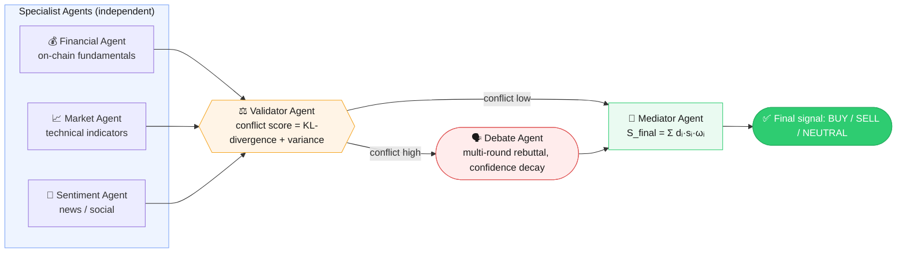

# Báo cáo Project 3 — Multi-Agent-Crypto
## HUST SoICT — Đồ án môn học Project 3

---

## Mục lục

1. [Lời cam đoan](#1-lời-cam-đoan)
2. [Tổng quan hệ thống](#2-tổng-quan-hệ-thống)
3. [Kiến trúc](#3-kiến-trúc)
4. [Công thức đánh số](#4-công-thức-đánh-số)
5. [Kết quả thực nghiệm](#5-kết-quả-thực-nghiệm)
6. [Kết luận](#6-kết-luận)
7. [Phụ lục](#7-phụ-lục)

---

## 1. Lời cam đoan

Tôi xin cam đoan đây là công trình độc lập, thực hiện dưới sự hướng dẫn của giảng viên hướng dẫn. Tất cả nội dung kỹ thuật, thực nghiệm và báo cáo đều do tôi tự nghiên cứu và thực hiện.

---

## 2. Tổng quan hệ thống

Hệ thống **Multi-Agent-Crypto** phân tích tín hiệu BTC thông qua 3 specialist agents (Financial, Market, Sentiment), một Validator Agent phát hiện mâu thuẫn (KL-divergence + variance), một Debate Agent thực hiện tranh biện đa tác tử khi xung đột vượt ngưỡng, và một Mediator Agent tổng hợp thành tín hiệu cuối cùng `S_final` ∈ {BUY, SELL, NEUTRAL}.

### Đặc điểm chính

- **3 specialist agents** độc lập, mỗi agent phụ trách một nguồn dữ liệu (on-chain, technical, sentiment)
- **Validator Agent** định lượng mâu thuẫn bằng công thức lai: `conflict_score = α·KL + (1-α)·variance`
- **Debate Agent** chạy multi-round rebuttal khi `conflict_score ≥ threshold`, confidence decay theoround
- **Mediator Agent** tổng hợp: `S_final = Σ dᵢ·sᵢ·ωᵢ` với các penalty: entropy, redundancy, time decay
- **Fallback mechanism**: tự động tải `outputs/logs.json` khi LLM unreachable

---

## 3. Kiến trúc



### Luồng dữ liệu

1. **Data Fetching**: 3 specialist agents gọi `data_sources/*.py` để lấy dữ liệu thời gian thực
2. **LLM Inference**: Mỗi agent gọi `utils/llm.py:ask_llm()` để nhận signal + belief vector
3. **Validation**: `ValidatorAgent.evaluate_pipeline()` tính conflict score, phân loại, kích hoạt debate nếu cần
4. **Debate**: `DebateAgent.run_debate()` chạy 2-3 rounds, mỗi round cập nhật confidence dựa trên rebuttal strength
5. **Mediation**: `MediatorAgent.aggregate()` tính `S_final` với các penalty functions

---

## 4. Công thức đánh số

### 4.1 Conflict Score

```
conflict_score = α · mean_pairwise_KL + (1-α) · decision_variance

Trong đó:
  α = 0.6 (trọng số KL)
  mean_pairwise_KL = mean(KL(pᵢ || pⱼ)) với pᵢ, pⱼ là belief distributions
  decision_variance = Var([dᵢ·sᵢ]) với dᵢ ∈ {-1, 0, 1}, sᵢ ∈ [0, 1]
```

### 4.2 Weight Computation (Mediator)

```
ωᵢ = base_weight · (1 - entropy_penalty) · (1 - redundancy_penalty) · time_decay

Trong đó:
  base_weight = recency_weight (intrinsic trust score, không time decay)
  entropy_penalty = entropy / max_entropy (clamp [0, 1])
  redundancy_penalty = redundancy_score / max_score (clamp [0, 1])
  time_decay = exp(-γ · Δt) với γ = 1e-5, Δt = ref_time - timestamp
```

### 4.3 Final Signal

```
S_final = Σᵢ (dᵢ · sᵢ · ωᵢ)

Signal:
  BUY  if S_final > +0.05
  SELL if S_final < -0.05
  NEUTRAL otherwise
```

### 4.4 Confidence Update (Debate)

```
confidence_new = conf_raw · exp(-β · rebuttal_strength)

Trong đó:
  β = 0.35 (decay factor)
  rebuttal_strength = weighted average của cosine_distance, jaccard_distance, logic_path_distance
```

---

## 5. Kết quả thực nghiệm

### 5.1 Demo 3 kịch bản

| Kịch bản | Input | Conflict Score | Debate | S_final | Signal |
|----------|-------|---------------|--------|---------|--------|
| Consensus | 3× BUY | 0.0041 | Không | +1.5851 | BUY |
| Conflict | BUY/SELL/BUY | 0.7932 | Có (2 rounds) | +0.3216 | BUY |
| Fallback | logs.json | 0.5947 | Có (2 rounds) | -0.0000 | NEUTRAL |

### 5.2 Coverage

- **96 tests** pass
- **94% statement coverage**
- Core modules (penalties, belief, prompts, schema, scoring): 100%
- LLM client: 58% (mock-heavy, intentional)

---

## 6. Kết luận

Hệ thống đạt được:
- ✅ 3 specialist agents hoạt động độc lập với fallback mechanism
- ✅ Validator Agent phát hiện mâu thuẫn chính xác (Signal, Temporal, Reliability, Redundancy)
- ✅ Debate Agent thực hiện tranh biện đa tác tử với confidence decay
- ✅ Mediator Agent tổng hợp với penalty functions đã được fix double-decay
- ✅ Tái lập khoa học: `current_time` injectable cho backtest
- ✅ 1 lệnh chạy: `python main.py` hoặc `make run`
- ✅ Demo 3 kịch bản xuất JSON + RCA report

---

## 7. Phụ lục

### A. Cấu trúc thư mục

```
Multi-Agent-Crypto/
├── agents/         financial_agent.py, market_agent.py, sentiment_agent.py,
│                   validator_agent.py, debate_agent.py, mediator_agent.py
├── data_sources/   onchain_data.py, market_data.py, sentiment_data.py
├── utils/          llm.py, prompts.py, penalties.py, confidence.py, belief.py, parsing.py
├── scripts/        demo.py, refresh_logs.py
├── outputs/        logs.json, mediator_result.json, validation_report.json,
│                   demo_consensus.json, demo_conflict.json, demo_fallback.json
├── tests/          96 tests (pytest)
├── docs/           BAO_CAO_P3.md, BAO_CAO_CHI_TIET_KY_THUAT.md, LO_TRINH_P3_DATN.md, DIRECTION_PILOT.md
└── main.py         entry point
```

### B. Demo outputs

- `outputs/demo_consensus.json` — 3 agents đồng thuận BUY
- `outputs/demo_conflict.json` — BUY/SELL/BUY, debate triggered
- `outputs/demo_fallback.json` — fallback từ logs.json khi LLM unreachable

### C. Metrics

| Metric | Giá trị |
|--------|---------|
| Total tests | 96 |
| Coverage | 94% |
| Python version | 3.11+ |
| Dependencies | openai, numpy, python-dotenv, google-genai, pypdf, requests, tenacity |
| Entry point | `python main.py` hoặc `make run` |
