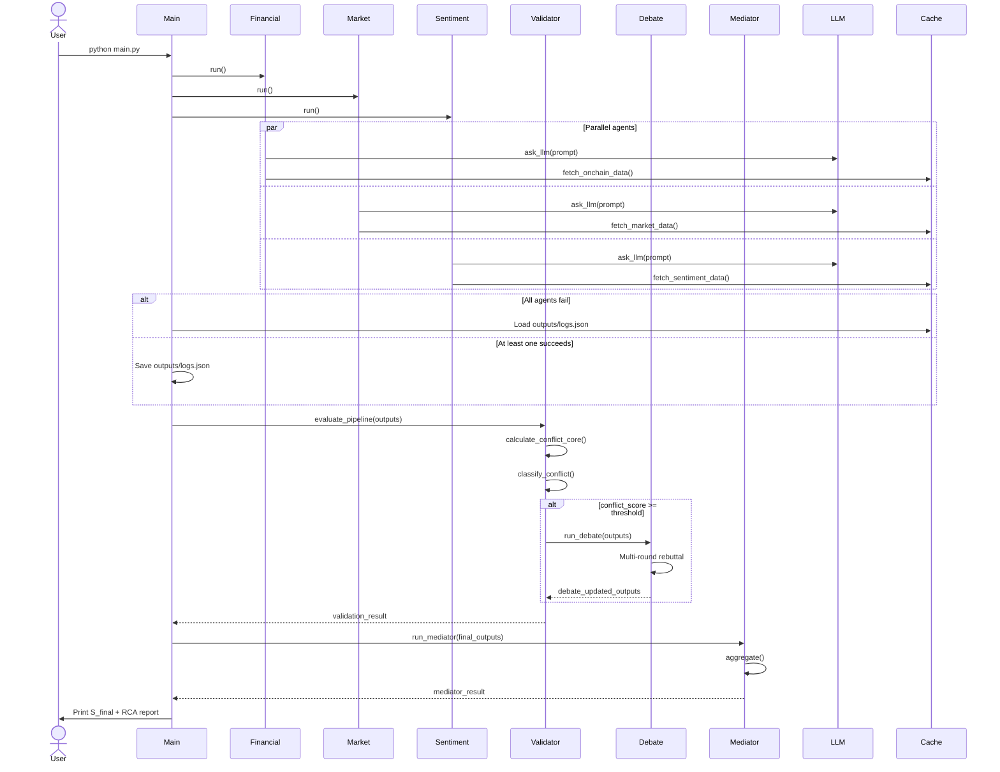
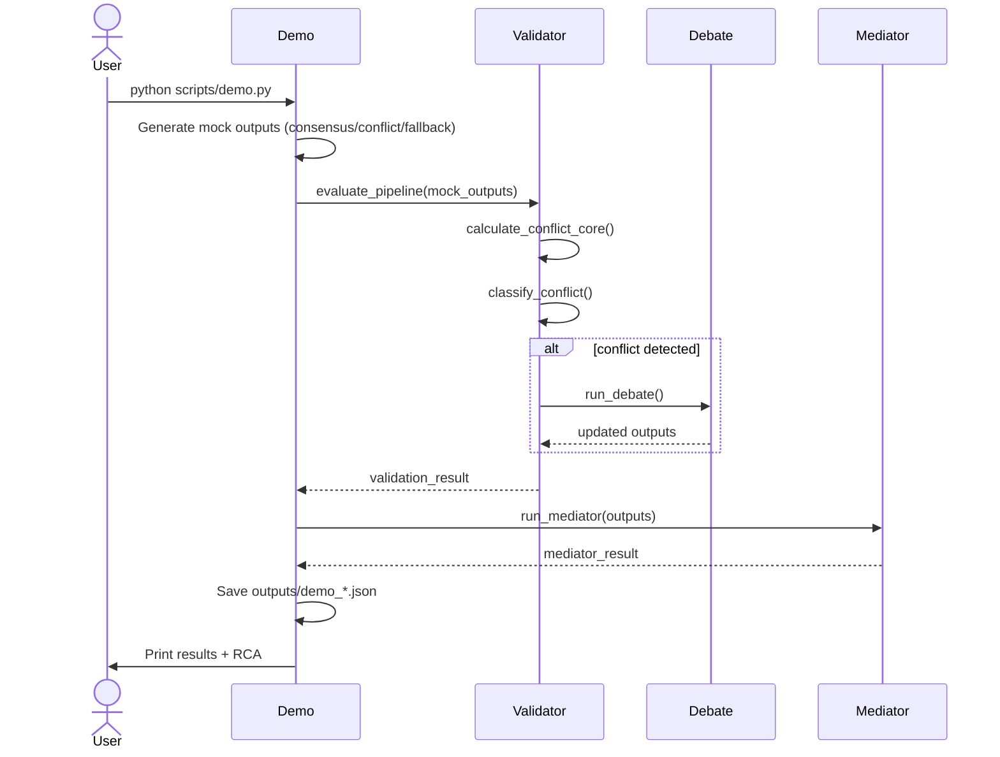
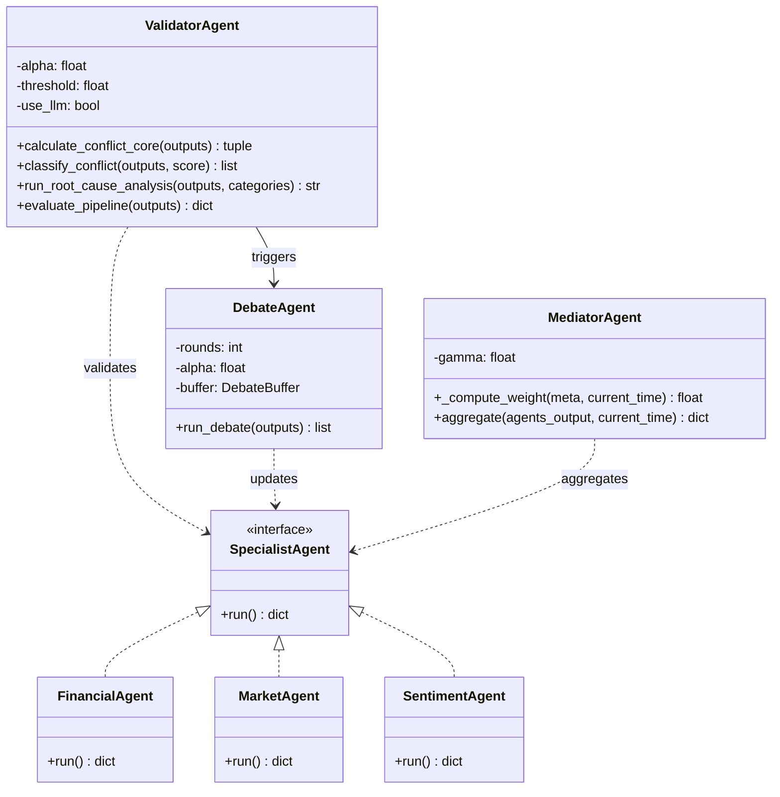
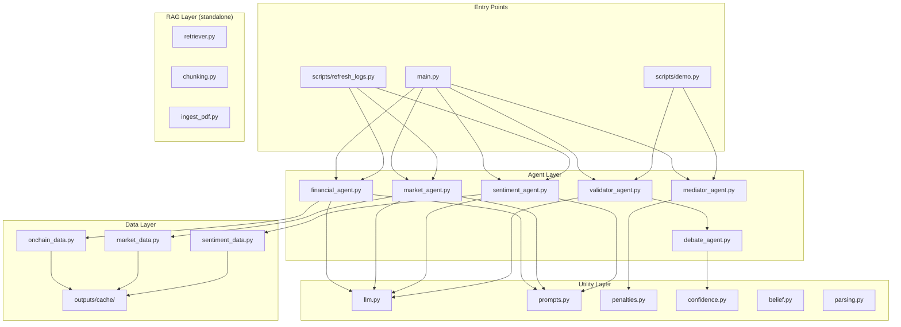

# UML Diagrams — Multi-Agent-Crypto

## Use-case Diagram

```mermaid
usecaseDiagram
    actor Researcher
    actor LLM_Service
    actor Data_API

    Researcher --> (Run Full Pipeline)
    Researcher --> (Refresh Cache)
    Researcher --> (Run Demo Scenarios)
    Researcher --> (Run Tests)

    (Run Full Pipeline) --> (Fetch Live Data)
    (Run Full Pipeline) --> (Validate Conflict)
    (Run Full Pipeline) --> (Run Debate)
    (Run Full Pipeline) --> (Aggregate Signal)
    (Run Full Pipeline) --> (Fallback to Cache)

    (Fetch Live Data) --> Data_API : Binance / blockchain.info / Alternative.me
    (Run Full Pipeline) --> LLM_Service : ask_llm()

    (Validate Conflict) --> (Compute KL Divergence)
    (Validate Conflict) --> (Compute Variance)
    (Validate Conflict) --> (Classify Conflict)

    (Run Debate) --> (Update Confidence)
    (Run Debate) --> (Rebuttal Strength)

    (Aggregate Signal) --> (Compute Weights)
    (Aggregate Signal) --> (Compute S_final)
```

## Sequence Diagram — Full Pipeline



## Sequence Diagram — Mock/Demo Pipeline



## Class Diagram (Core)



## Component Diagram


